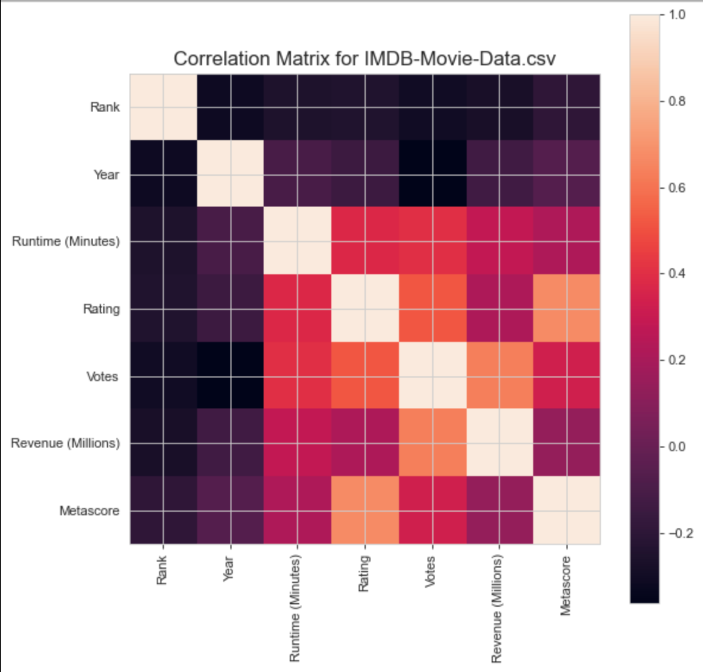
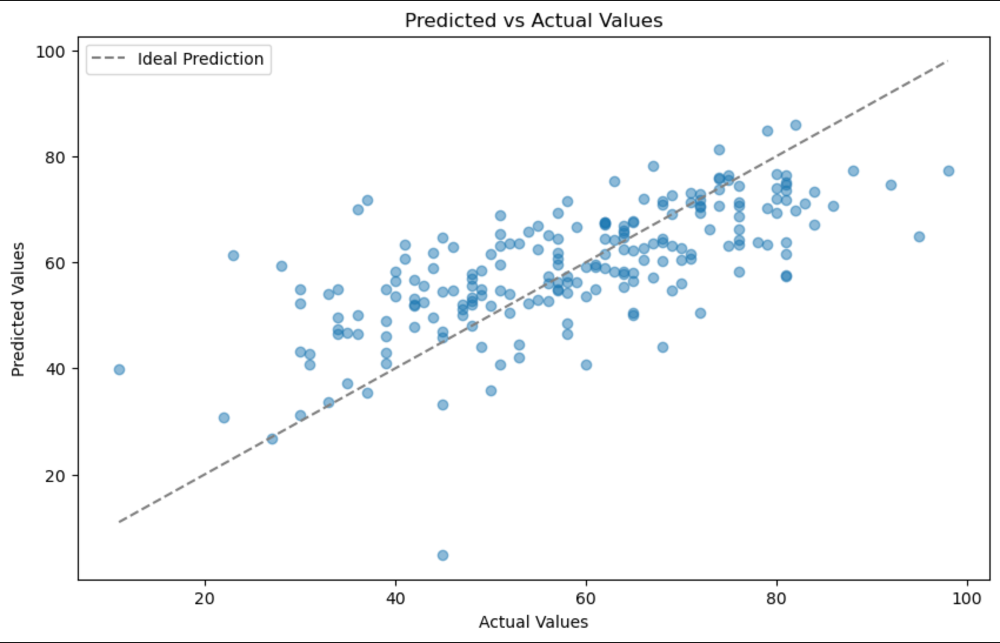
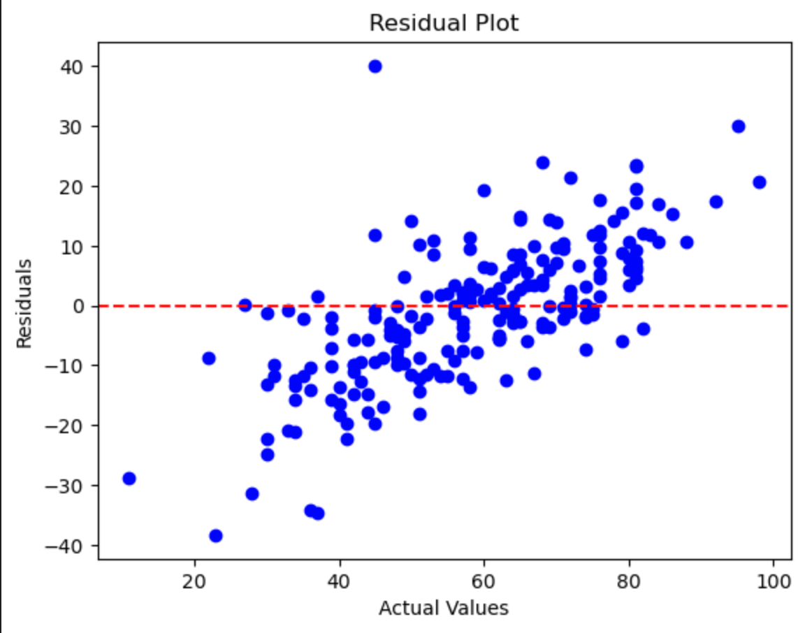

<!DOCTYPE html>  
<html>  
 <body>  
      <h1>Let's Go To The Movies Project</h1> 
 <body>  
</html>

The project will focus on comparing and contrasting specific attributes from a substantial movie dataset. When you think of movies, often times we only think of going to the movies as a movie-goer. However, there is an entire area of analysis that is beyond just the movie-goer experience. In this study we will focus on evaluating the other attributes of the movie experience. We will consider the following: Movie Rank, Genre, Year, Runtime, Rating, Votes, Revenue and Metascore. The attribute Metascore from the dataset will be used for linear regression analysis. There will be a more expansive discussion of this evaluation below. 

<!DOCTYPE html>  
<html>  
 <body>  
      <h2>Reason for this Research</h2> 
 <body>  
</html>

    This is a requirement for Phase I of the Data Science Fellowship completion. Due: 12-15-2023
 With this project the goal is to reinforce concepts learned throughout Phase I in the TKH Innovation Fellowship. Additionally, possibly uncover some interesting facts about film making, movie goer's, human nature and how world events play a part in even the selection of the movies that we watch.

<!DOCTYPE html>  
<html>  
 <body>  
      <h2>EDA: Exploratory Data Analysis</h2> 
 <body>  
</html>

<!DOCTYPE html>  
<html>  
 <body>  
      <h3>Hypothesis (TBD)</h3> 
 <body>  
</html>

<!DOCTYPE html>  
<html>  
 <body>  
      <h3>Research</h3> 
 <body>  
</html>

Research Goals
> Goal 1: Comparative Analysis:  To include specific attributes or details provided that can be used in creating the comparative analysis that is necessary.
>
> Attributes
> The Attributes for analysis are: Movie Rank, Genre, Year, Runtime, Rating, Votes, Revenue and Metascore
> 
> Goal 2: Conduct linear regression analysis on an attribute of choice: Metascore

## 1. DATA

The data is being furnished by an authored contributor and researcher,Promptcloud from Kaggle. This dataset represents a 10-year history of movies between the years 2006-2016.
The location being accessed is: https://www.kaggle.com/datasets/PromptCloudHQ/imdb-data?select=IMDB-Movie-Data.csv

## 2. METHOD

The primary objective is the begin with clean data. Then place that data into a predictive model. 
1. Linear Regression Model

## 3. CLEANING REPORT

The purpose of this is to present the data in the most unencumbered manner psossible. The data has been cleared of duplicate rows, and columns, NAN, Non-NaN, and Blanks. However, from the EDA it was deemed that the dataset used did not require much cleaning for analysis. 

## 4. EDA

From the EDA some key findings showcased were:

### Correlation Matrix:

From the matrix, it could be seen that the attributes that seemed to have high correlation with other attributes were: Rating, Votes, Revenue, and Metascore. These attributes are numerical columns and can be used for possible linear regression analysis. 

## 5. MODELING

Provide the Linear Regression Model Data visualization and written analysis:

This linear regression model tests against the Metascore attribute alongside the rest of the numerical columns within this dataset. From the visualized model, it can be seen that there is satisfactory amount of correlation with the actual and predicted values. To further gauge if this was an appropriate regression model, residual analysis was also conducted. 

### Residual Analysis:

In a linear regression model, characteristics such as 

#7. FURTHER RESEARCH

TBD

(Provide written analysis)

## 8. CREDITS

Thank you to the kaggle dataset used for this project:  https://www.kaggle.com/datasets/PromptCloudHQ/imdb-data?select=IMDB-Movie-Data.csv

